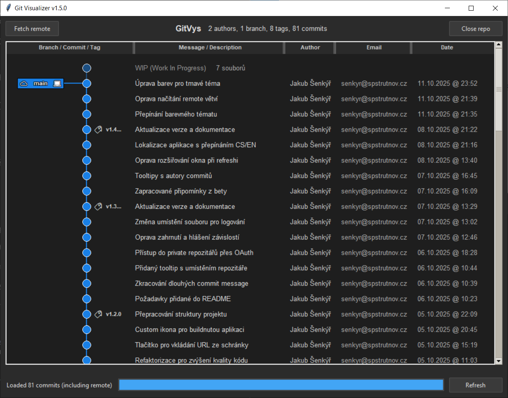

# Git Visualizer

Jednoduchá desktop aplikace pro vizualizaci Git repozitářů určená především pro studenty.

## Rychlý start

1. Stáhni a spusť `GitVisualizer.exe` (pozor na požadavky)
2. Přetáhni složku Git repozitáře do aplikace
3. Prohlížej si historii commitů graficky

## Požadavky

### Pro spuštění aplikace (.exe)

- **[Git](https://git-scm.com/downloads)** - nutný pro práci s repozitáři
- Python **není** potřeba (je zabalený v .exe)

### Pro spuštění ze zdrojového kódu (development)

- **[Python 3.8+](https://www.python.org/downloads/)**
- **[Git](https://git-scm.com/downloads)**
- Nainstalovat závislosti z `requirements.txt`:

  ```bash
  pip install -r requirements.txt
  cd src
  python main.py
  ```

### Pro buildnutí .exe souboru

- **[Python 3.8+](https://www.python.org/downloads/)**
- **PyInstaller**:

  ```bash
  pip install pyinstaller
  ```

- Build skript: `build/build-exe.bat`
- Build příkaz: `python build/build.py`

## Funkce

- **Drag & drop rozhraní** - jednoduše přetáhni složku repozitáře nebo URL
- **URL support** - otevření remote repozitářů (GitHub, GitLab, Bitbucket)
- **Vizualizace podobná GitKrakenu** - přehledný graf větví a commitů
- **Tag podpora** - zobrazení Git tagů s emoji ikonami
- **Remote větve** - načítání remote větví tlačítkem
- **Interaktivní sloupce** - změna šířky sloupců táhnutím
- **Tooltips** - detailní informace při najetí myší
- **Smooth scrolling** - plynulé scrollování s momentem
- **Scrollovatelné zobrazení** - procházej historii repozitáře
- **Barevné rozlišení větví** - každá větev má svou barvu
- **Refresh (F5)** - obnovení repozitáře
- **Jednoduché spuštění** - samostatný .exe soubor

## Screenshot



*Vizualizace Git repozitáře s barevnými větvemi, tagy a commit historií*

## Vývoj

Viz [docs/INSTALLATION.md](docs/INSTALLATION.md) pro instrukce k instalaci a spuštění ze zdrojového kódu.

## Dokumentace

- **[docs/INSTALLATION.md](docs/INSTALLATION.md)** - Instalace ze zdrojového kódu a vývoj
- **[docs/BUILD-INSTRUCTIONS.md](docs/BUILD-INSTRUCTIONS.md)** - Vytvoření .exe pomocí PyInstaller
- **[docs/DESIGN.md](docs/DESIGN.md)** - Architektura a design projektu
- **[docs/CHANGELOG.md](docs/CHANGELOG.md)** - Historie verzí a změn
- **[CLAUDE.md](CLAUDE.md)** - Instrukce pro Claude Code
- **[LICENSE.md](LICENSE.md)** - Licence projektu

## Struktura projektu

```
git-visualizer/
├── src/                 # Zdrojový kód
│   ├── main.py          # Vstupní bod aplikace
│   ├── gui/             # GUI komponenty
│   │   ├── main_window.py   # Hlavní okno
│   │   ├── graph_canvas.py  # Graf komponenta
│   │   └── drag_drop.py     # Drag & drop funkcionalita
│   ├── repo/            # Git operace
│   │   └── repository.py    # Práce s Git repozitářem
│   ├── visualization/   # Vizualizace
│   │   ├── graph_drawer.py  # Kreslení grafu
│   │   ├── layout.py        # Rozmístění uzlů
│   │   └── colors.py        # Barevné schéma
│   └── utils/           # Pomocné utility
│       ├── data_structures.py # Datové struktury
│       ├── constants.py       # Konstanty aplikace
│       └── logging_config.py  # Centralizované logování
├── build/               # Build skripty a assety
│   ├── build.py         # Build skript pro .exe
│   ├── icon.ico         # Ikona aplikace
│   └── feather.png      # Zdrojový asset ikony
├── docs/                # Dokumentace
├── dist/                # Build výstup (.exe)
└── [config files]       # setup.py, requirements.txt, atd.
```

## Technologie

- **Python 3.8+** - hlavní jazyk
- **tkinter** - GUI framework
- **GitPython** - práce s Git repozitáři
- **Pillow** - vykreslování grafu
